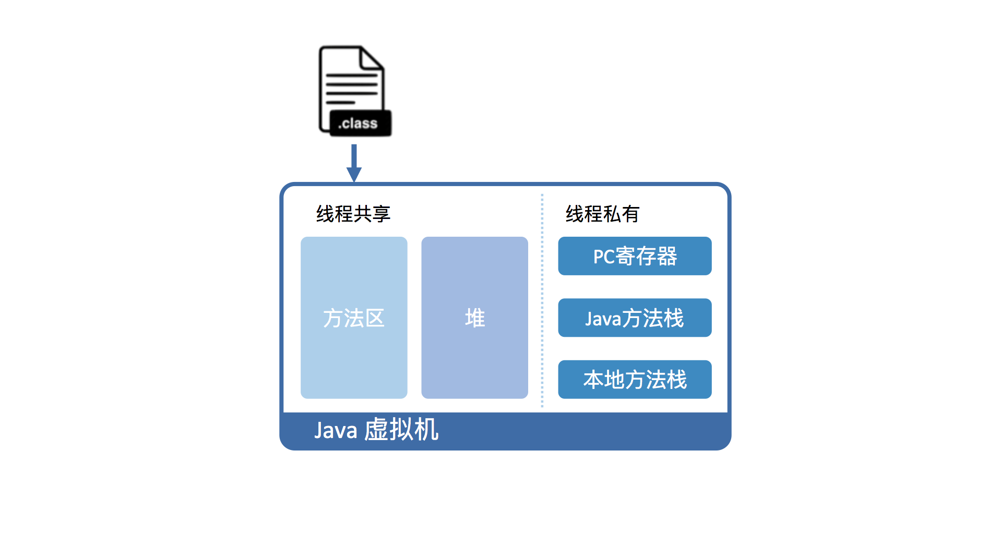
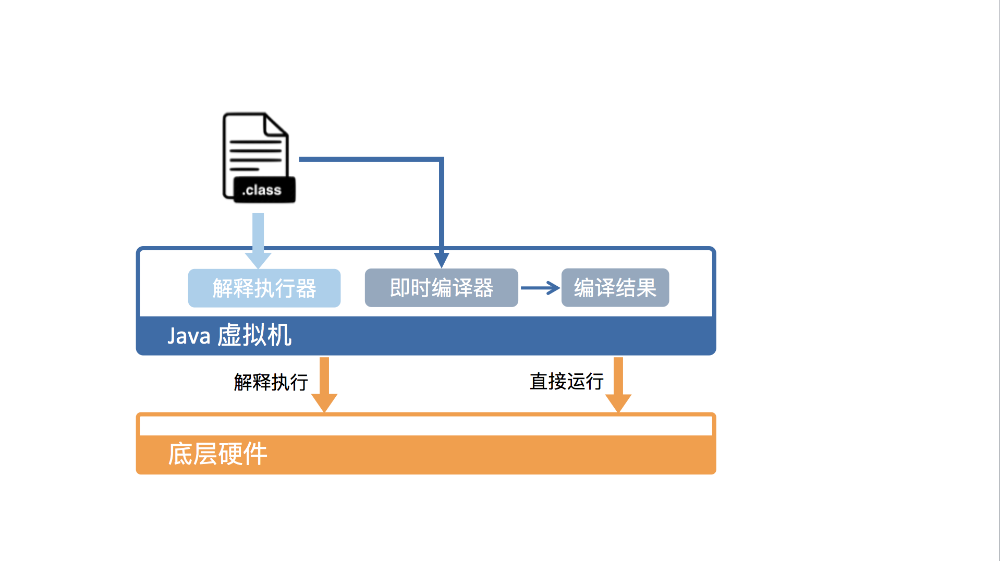

# 为什么 Java 要在虚拟机里运行？

Java 作为一门高级程序语言，它的语法非常复杂，抽象程度也很高。因此，直接在硬件上运行这种复杂的程序并不现实。所以呢，在运行 Java 程序之前，我们需要对其进行一番转换。

这个转换具体是怎么操作的呢？当前的主流思路是这样子的，设计一个面向 Java 语言特性的虚拟机，并通过编译器将 Java 程序转换成该虚拟机所能识别的指令序列，也称 Java 字节码。这里顺便说一句，之所以这么取名，是因为 Java 字节码指令的操作码（opcode）被固定为一个字节。

举例来说，下图的中间列，正是用 Java 写的 Helloworld 程序编译而成的字节码。可以看到，它与 C 版本的编译结果一样，都是由一个个字节组成的。

并且，我们同样可以将其反汇编为人类可读的代码格式（如下图的最右列所示）。不同的是，Java 版本的编译结果相对精简一些。这是因为 Java 虚拟机相对于物理机而言，抽象程度更高。

```assembly
# 最左列是偏移；中间列是给虚拟机读的机器码；最右列是给人读的代码
0x00:  b2 00 02         getstatic java.lang.System.out
0x03:  12 03            ldc "Hello, World!"
0x05:  b6 00 04         invokevirtual java.io.PrintStream.println
0x08:  b1               return
```

Java 虚拟机可以由硬件实现[1]，但更为常见的是在各个现有平台（如 Windows_x64、Linux_aarch64）上提供软件实现。这么做的意义在于，一旦一个程序被转换成 Java 字节码，那么它便可以在不同平台上的虚拟机实现里运行。这也就是我们经常说的“一次编写，到处运行”。

虚拟机的另外一个好处是它带来了一个托管环境（Managed Runtime）。这个托管环境能够代替我们处理一些代码中冗长而且容易出错的部分。其中最广为人知的当属自动内存管理与垃圾回收，这部分内容甚至催生了一波垃圾回收调优的业务。

除此之外，托管环境还提供了诸如数组越界、动态类型、安全权限等等的动态检测，使我们免于书写这些无关业务逻辑的代码。

# Java 虚拟机具体是怎样运行 Java 字节码的？

下面我将以标准 JDK 中的 HotSpot 虚拟机为例，从虚拟机以及底层硬件两个角度，给你讲一讲 Java 虚拟机具体是怎么运行 Java 字节码的。

从虚拟机视角来看，执行 Java 代码首先需要将它编译而成的 class 文件加载到 Java 虚拟机中。加载后的 Java 类会被存放于方法区（Method Area）中。实际运行时，虚拟机会执行方法区内的代码。

如果你熟悉 X86 的话，你会发现这和段式内存管理中的代码段类似。而且，Java 虚拟机同样也在内存中划分出堆和栈来存储运行时数据。

不同的是，Java 虚拟机会将栈细分为面向 Java 方法的 Java 方法栈，面向本地方法（用 C++ 写的 native 方法）的本地方法栈，以及存放各个线程执行位置的 PC 寄存器。



在运行过程中，每当调用进入一个 Java 方法，Java 虚拟机会在当前线程的 Java 方法栈中生成一个栈帧，用以存放局部变量以及字节码的操作数。这个栈帧的大小是提前计算好的，而且 Java 虚拟机不要求栈帧在内存空间里连续分布。

当退出当前执行的方法时，不管是正常返回还是异常返回，Java 虚拟机均会弹出当前线程的当前栈帧，并将之舍弃。

从硬件视角来看，Java 字节码无法直接执行。因此，Java 虚拟机需要将字节码翻译成机器码。

在 HotSpot 里面，上述翻译过程有两种形式：第一种是解释执行，即逐条将字节码翻译成机器码并执行；第二种是即时编译（Just-In-Time compilation，JIT），即将一个方法中包含的所有字节码编译成机器码后再执行。



前者的优势在于无需等待编译，而后者的优势在于实际运行速度更快。HotSpot 默认采用混合模式，综合了解释执行和即时编译两者的优点。它会先解释执行字节码，而后将其中反复执行的热点代码，以方法为单位进行即时编译。

# Java 虚拟机的运行效率究竟是怎么样的？

HotSpot 采用了多种技术来提升启动性能以及峰值性能，刚刚提到的即时编译便是其中最重要的技术之一。

即时编译建立在程序符合二八定律的假设上，也就是百分之二十的代码占据了百分之八十的计算资源。

对于占据大部分的不常用的代码，我们无需耗费时间将其编译成机器码，而是采取解释执行的方式运行；另一方面，对于仅占据小部分的热点代码，我们则可以将其编译成机器码，以达到理想的运行速度。

理论上讲，即时编译后的 Java 程序的执行效率，是可能超过 C++ 程序的。这是因为与静态编译相比，即时编译拥有程序的运行时信息，并且能够根据这个信息做出相应的优化。

举个例子，我们知道虚方法是用来实现面向对象语言多态性的。对于一个虚方法调用，尽管它有很多个目标方法，但在实际运行过程中它可能只调用其中的一个。

这个信息便可以被即时编译器所利用，来规避虚方法调用的开销，从而达到比静态编译的 C++ 程序更高的性能。

为了满足不同用户场景的需要，HotSpot 内置了多个即时编译器：C1、C2 和 Graal。Graal 是 Java 10 正式引入的实验性即时编译器。

之所以引入多个即时编译器，是为了在编译时间和生成代码的执行效率之间进行取舍。C1 又叫做 Client 编译器，面向的是对启动性能有要求的客户端 GUI 程序，采用的优化手段相对简单，因此编译时间较短。

C2 又叫做 Server 编译器，面向的是对峰值性能有要求的服务器端程序，采用的优化手段相对复杂，因此编译时间较长，但同时生成代码的执行效率较高。

从 Java 7 开始，HotSpot 默认采用分层编译的方式：热点方法首先会被 C1 编译，而后热点方法中的热点会进一步被 C2 编译。

为了不干扰应用的正常运行，HotSpot 的即时编译是放在额外的编译线程中进行的。HotSpot 会根据 CPU 的数量设置编译线程的数目，并且按 1:2 的比例配置给 C1 及 C2 编译器。

在计算资源充足的情况下，字节码的解释执行和即时编译可同时进行。编译完成后的机器码会在下次调用该方法时启用，以替换原本的解释执行。

#### [下一篇：2.  Java的基本类型](basic/2.java-basic-type.md)